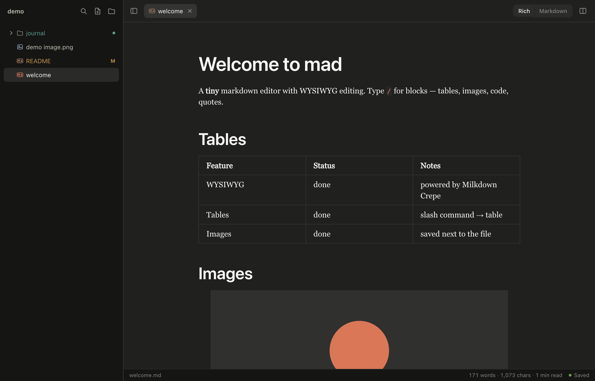
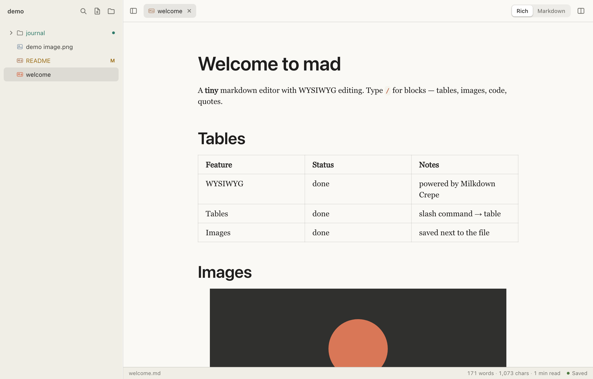

# mad

**A clean markdown editor for folders full of specs, notes and documentation.**

No build system. No marketplace. No opinions about your JavaScript. Free and open
source, permanently.



## Install

Grab the latest `.dmg` from [Releases](https://github.com/digitaljohn/mad/releases),
open it, and drag **mad** to Applications. One universal build covers both Apple
Silicon and Intel.

The first launch needs one extra click, because these builds aren't signed with a
paid Apple Developer ID: macOS will say it can't verify the app, and you open
**System Settings → Privacy & Security** and click **Open Anyway**. Once per
install. If you'd rather not click through it:

```bash
xattr -d com.apple.quarantine /Applications/mad.app
```

Or build it yourself — see [Running it](#running-it).

After that it keeps itself current: mad looks for a new release shortly after
launch and offers it, or you can ask any time with **mad ▸ Check for Updates…**.
Agree and it downloads, installs and relaunches on its own.

## Why this exists

I work in a hardware team. The documentation lives in markdown — a folder of specs,
a heap of diagrams and screenshots, and more tables than anyone should maintain by
hand. The engineers writing it wanted one simple thing: somewhere pleasant to edit
it all.

Nothing fitted. The market splits neatly in two.

**The beautiful ones.** Gorgeous typography, tasteful little animations, a launch
video with a lo-fi soundtrack. Also: can't open a folder, treat an image as an
unwelcome surprise, and have no idea which documents were touched since Friday.
Wonderful for writing a blog post about deep work. Useless for maintaining a spec.

**The powerful ones.** Which is to say VS Code, or something in a VS Code costume.
Congratulations — the engineer who wanted to straighten out a table now has a
terminal, a debugger, an extension marketplace, twelve panels and a JSON file that
configures how the other JSON files behave.

So mad is the bit in the middle that nobody had bothered to build. Open a folder.
Browse the tree. Drop in an image. Drag a table row where it belongs. Glance at the
sidebar and see what's changed since the last commit. Then it gets out of the way,
which is the entire job.

## Features

### Writing

Proper WYSIWYG markdown — headings, lists, task lists, quotes, code blocks, links.
Press `/` for a block menu, select text for a formatting toolbar, or just use the
shortcuts you already have in your fingers. Flip to raw markdown whenever you stop
trusting it (`⌘⇧M`), or run a **split view** with source on the left, live preview
on the right, scrolling in step.

Mermaid diagrams render live inside ` ```mermaid ` fences, for when the spec needs
a state machine and you'd rather not open a drawing app and start aligning boxes
with your mouse.

### Images

Paste a screenshot. Drag one in from Finder. Drag one out of the sidebar into the
document. However it arrives, it's saved **next to the markdown file** and
referenced with a relative path — because the alternatives are a base64 blob
wedged into your prose, or a link to a cloud bucket that quietly dies in eighteen
months. Neither is a documentation strategy. Click any image in the tree to view it
full size with its dimensions.

### Tables

Tables in raw markdown are a pipe-alignment exercise nobody has ever enjoyed. So:
build one from the block menu, then reshape it with the handles — drag rows and
columns into the order you want, set per-column alignment, insert and delete
without counting anything. What lands on disk is tidy, aligned and diffable.

### Seeing what changed

If the folder is a git repository, the tree and tabs mark themselves up: a letter
per file (`M` modified, `A` added, `U` untracked, `D` deleted, `R` renamed, `!`
conflict), the name tinted to match, and a dot on any folder hiding changes further
down. It updates when you save, when files move on disk, when you commit or stage,
and whenever the window regains focus — so the commit you made in a terminal thirty
seconds ago is already on screen.

`⌘⇧D` shows the diff for the document you're in: a proper unified diff against the
last commit, staged changes included, with a `+N −M` count. A file that was never
committed reads as wholly added, which is what it is. From there — or from the
tree's context menu — **Discard Changes** puts a file back the way you committed
it. It tells you plainly first, because that one is not undoable. A file with
nothing to go back to is moved to the Trash rather than deleted.

There is no refresh button. There is no refresh button anywhere in this app. That
is deliberate.

### Finding things

`⌘P` jumps to any file by fuzzy name. `⌘⇧P` opens a command palette for everything
else, and typing `#` lists the headings in the current document. `⌘F` searches the
document with case and whole-word toggles; `⌘⇧F` searches every file in the folder
at once — in parallel, in Rust — and drops you on the matching line.

### Getting around

Tabs across the top: drag to reorder, `⌘1`–`⌘9` to jump, middle-click to close, and
a small dot when something's unsaved. The file tree does real keyboard navigation,
plus rename in place, duplicate, drag-to-move, Reveal in Finder and Copy Path.
Deleting sends the file to the **system Trash**, not to the void.

A status bar keeps the word count, character count, reading time and cursor
position where you can see them. There's light and dark, adjustable text size,
spell check, a sidebar that collapses, and HTML export for the colleague who will
ask for "just a link I can open".

Quit and it all comes back — open tabs, expanded folders, sidebar width, text size,
window position. Because reconstructing your workspace every morning is not a
feature.

<details>
<summary>Light mode, for those who work in daylight</summary>



</details>

## Your files stay yours

A spec lives in git for years. Most editors treat that as a charming hypothetical.

Open a document in mad, save it, and the diff contains what you changed. Nothing
else. Your `-` bullets stay `-`. Tight lists stay tight. `---` stays `---`. The alt
text on your diagrams survives, which sounds like a low bar right up until you
discover it isn't. There's a test that pushes a document through the rich editor
and back out again and asserts the bytes are identical, because a forty-line diff
from a one-word edit belongs to someone else's genre.

<details>
<summary>Clearing that bar meant fixing three bugs in the library underneath</summary>

All three fired the instant you opened a file and saved it, which is to say:
constantly.

- The image block stored its zoom level in the markdown `alt` field, so
  `` came back as ``. Alt text: gone.
- `bullet_list.spread` was kept as the string `"false"` and passed to mdast
  unchanged — and `"false"` is truthy — so every bullet list serialized *loose*,
  growing a blank line between items on every single save.
- remark-stringify's defaults helpfully rewrote `-` bullets to `*` and `---` to
  `***`.

Patched in [`src/editor.ts`](src/editor.ts) by overriding the node schemas *after*
Crepe registers its own; the duplicate node id wins because Milkdown assembles its
schema with `Object.fromEntries`. Documented nowhere. You're welcome.

The fourth one was ours: ProseMirror keeps a trailing empty paragraph, which used
to append a blank line on the first save of every document.

</details>

Nor does it lose work:

- Writes go **temp file → fsync → rename**, carrying the original's permissions
  across. A full disk or a hard crash cannot truncate a document.
- Every open file carries an mtime+size stamp. If it changed on disk *and* in the
  editor, mad asks which version wins rather than picking a winner on your behalf.
- Edit a file in another app and mad quietly reloads it — unless you have unsaved
  changes, in which case see above.
- New files are drafts. Nothing touches the disk until you say where.

## Shortcuts

| | |
| --- | --- |
| `⌘P` / `⌘⇧P` | Go to file / command palette |
| `⌘N` / `⌘⇧N` | New file / new folder |
| `⌘O` | Open folder |
| `⌘S` / `⌘⇧S` | Save / Save As |
| `⌘W` | Close tab |
| `⌘1`…`⌘9`, `⌘⌥←/→` | Switch tabs |
| `⌘F` / `⌘⌥F` / `⌘⇧F` | Find / find & replace / find in files |
| `⌘⇧M` / `⌘⇧V` | Toggle markdown source / split preview |
| `⌘⇧D` | Show changes for this document |
| `⌘\` | Toggle sidebar |
| `⌘=` / `⌘-` / `⌘0` | Zoom in / out / actual size |
| `⌘B` `⌘I` `⌘E` | Bold / italic / inline code |
| `F2`, `⌫` | Rename / delete in the tree |

## Running it

```bash
npm install
npm run tauri dev
```

`npm run dev` on its own serves the whole UI in a plain browser against an
in-memory demo workspace — no Rust, no Tauri, no waiting. Most of the styling was
done that way, and it's how the screenshots above were taken.

```bash
npm test              # 273 frontend unit tests (Vitest + jsdom)
npm run test:rust     # 54 Rust tests, several against real git repositories
npm run check         # everything CI runs: types, both suites, coverage, clippy
npm run tauri build
```

Releases are cut by tagging; see [docs/RELEASING.md](docs/RELEASING.md).

Every pull request runs the lot on CI, plus a release build. Coverage of the
tested frontend modules is enforced at 100% statements/functions/lines — see
[CONTRIBUTING.md](CONTRIBUTING.md) for what that does and doesn't include.

## How it's put together

```
src/
  main.ts      app wiring: tabs, session, menus, search, git, shortcuts
  editor.ts    Crepe wrapper: save chain, conflict resolution, find,
               split view, the markdown round-trip fixes, HTML export
  tree.ts      folder browser: keyboard nav, drag & drop, git decorations
  palette.ts   fuzzy command palette
  toast.ts     notifications that don't block you
  backend.ts   the Tauri IPC surface, plus an in-memory browser mock
  styles.css   Claude theme tokens, dark and light
src-tauri/
  src/lib.rs   every command, the native menu, the filesystem watcher
```

Two source trees, one app: `src/` runs in the webview, `src-tauri/` is the Rust
process that owns the filesystem. Despite its name, `src-tauri/` contains no Tauri
— the framework arrives from crates.io like any other dependency, and
`node_modules/` and `target/` are both gitignored. It's simply where Tauri's CLI
expects your Rust to live, and every doc page it will ever hand you says
`src-tauri/…`, so it stays put.

The Rust side owns the filesystem and the native menu. There's no `fs` plugin and
no asset protocol, so the app ships with a real CSP and no wildcard scopes — images
cross the IPC bridge as base64 data URLs instead. The tests live at the bottom of
`lib.rs` and cover the things that would actually ruin your afternoon: atomic
writes, save conflicts, path traversal in image names, git porcelain parsing, and a
real `git init`'d repository.

## The name

Short for **ma**rk**d**own. Also an accurate description of how one feels after
reading a markdown serializer's source code. Both readings are supported.

## Licence

[MIT](LICENSE). Free and open source, and it is staying that way. There is no pro
tier, no seat pricing, no "mad for Teams", and nobody will ever email you to ask
how your trial is going. It's a markdown editor.

---

<sub>Written with [Claude Code](https://claude.com/claude-code).</sub>
